<!-- HEADER -->
<div align="center">
  
</div>

<!-- TYPING ANIMATION -->
<div align="center">
  <a href="https://git.io/typing-svg">
    
  </a>
</div>

<br/>

<!-- SOCIAL BADGES -->
<div align="center">

[](https://linkedin.com/in/akshatbarve)
[](mailto:barveakshat091@gmail.com)
[](https://github.com/barveakshat)
[](https://leetcode.com/barveakshat)
[](https://www.credly.com/badges/ba21d63e-bb6f-4579-9193-dc007a89ef6e/public_url)


</div>

<br/>

---

<!-- ABOUT + TERMINAL VISUAL — TWO COLUMN LAYOUT -->
<table align="center" border="0" width="96%">
<tr>
<td width="55%" valign="top">

### 👨‍💻 About Me

```java
@Component
public class AkshatBarve {

  String role   = "Cloud / DevOps Engineer";
  String school = "VIT Bhopal · CGPA 8.92";

  String[] building = {
    "FinOps Dashboard w/ Anomaly Detection",
    "Serverless Event-Driven Pipeline",
    "AI Resume Screener (Spring Boot + AWS)"
  };

  String[] expertise = {
    "AWS (EC2, S3, RDS, DynamoDB, Lambda)",
    "Terraform & Infrastructure as Code",
    "CI/CD (GitHub Actions)",
    "Observability (Prometheus, Grafana)",
    "Backend APIs & Async Pipelines"
  };

  String goal = "Cloud Engineer / DevOps / SRE role";
}
```

</td>
<td width="45%" valign="top" align="center">



</td>
</tr>
</table>

---

## 🛠️ Tech Stack

<div align="center">


</div>

---

## 📦 Featured Builds

<table align="center" width="96%">
<tr>
<td width="33%" valign="top" align="center">

**☁️ FinOps Cost Anomaly Dashboard**

AWS cost telemetry → anomaly detection → alerting, so spend spikes get caught before the invoice does.

`AWS` `Lambda` `CloudWatch` `Terraform`

</td>
<td width="33%" valign="top" align="center">

**⚡ Serverless Event-Driven Pipeline**

Fully async, event-driven data flow — no servers to babysit, scales on its own.

`Lambda` `SQS/SNS` `DynamoDB` `IaC`

</td>
<td width="33%" valign="top" align="center">

**🤖 AI Resume Screener**

Spring Boot API + AWS backend that screens resumes automatically — built to cut manual review time.

`Spring Boot` `AWS` `Java` `REST`

</td>
</tr>
</table>

---

## 🏅 Certifications

<div align="center">

| Badge | Certification | Issuer | Date |
|:---:|:---|:---|:---:|
| ☁️ | [**AWS Certified Cloud Practitioner**](https://www.credly.com/badges/ba21d63e-bb6f-4579-9193-dc007a89ef6e/public_url) | Amazon Web Services | Feb 2026 |
| ☁️ | **AWS Certified Solutions Architect – Associate (SAA-C03)** | Amazon Web Services | In Progress |
| 🔧 | [**DevOps Fundamentals**](https://courses.ibmcep.cognitiveclass.ai/certificates/5c170b21ac294f489d6fbbb0c62cef6d) | IBM Career Education | Mar 2025 |
| ☕ | [**Object Oriented Programming in Java**](https://coursera.org/verify/47B4CLPBPVEU) | Coursera | Jun 2025 |
| ☁️ | [**Fundamentals of Cloud Computing**](https://coursera.org/verify/4BHZXMML2GNT) | Coursera | Jun 2025 |

</div>

---

## 📊 GitHub Stats

<div align="center">




<br/>



</div>

---

<!-- ACTIVITY GRAPH -->
<div align="center">

### 📈 Contribution Activity

[](https://github.com/ashutosh00710/github-readme-activity-graph)

</div>

<!-- SNAKE CONTRIBUTION ANIMATION -->
<div align="center">

### 🐍 Commit History, Visualized


<sub>Generated by a GitHub Action — see setup note below.</sub>

</div>

---

<!-- FOOTER -->
<div align="center">
  
</div>
